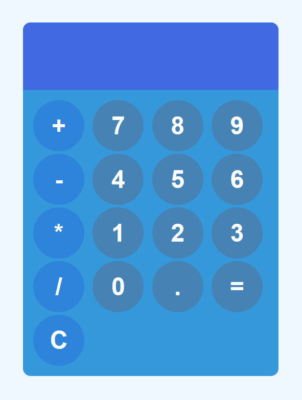

# Calculator App

## Description
This is a simple web calculator that allows users to perform basic calculations.

## Features
- Addition (+)
- Subtraction (-)
- Multiplication (*)
- Division (/)

## Project Screenshot

## Usage
1. Open 'index.html' in a web browser
2. Use the on-screen buttons to input numbers and perform operations.
3. Press the "=" button to calculate and display the result.
4. Press the "C" button to clear the display.

## License
This project is licensed under the [MIT License](LICENSE) - see the [LICENSE](LICENSE) file for details.
